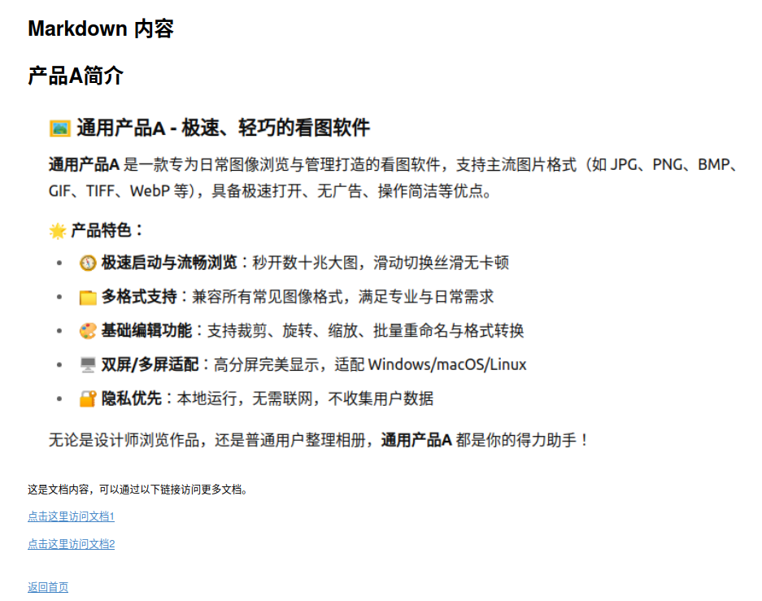
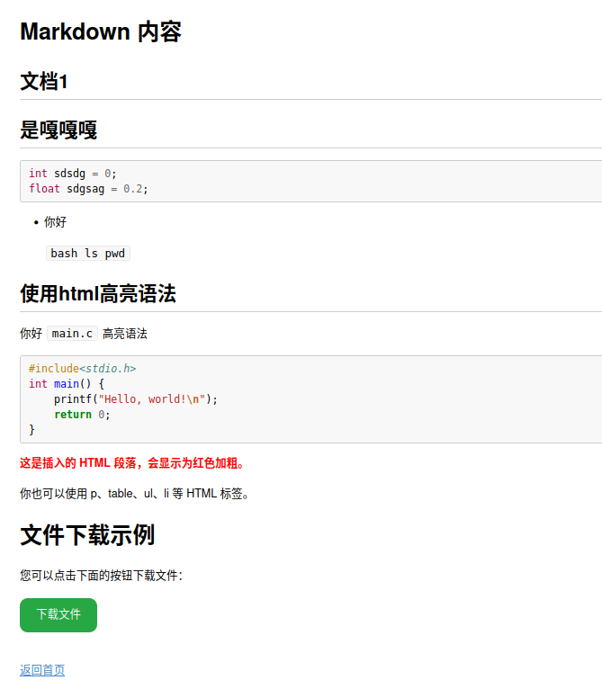

# 自定义的本地web服务器配置
使用python+nginx搭建本地markdown的web界面
## 准备开发环境
* 安装和配置nginx
```bash
sudo apt install nginx -y
sudo systemctl start nginx
sudo systemctl enable nginx #设置开机自启动
```
* 手动安装相关的依赖
```bash
pip install Flask
pip install markdown
```
* 后台运行脚本
```
python3 ./main.py
```
## 展示界面





